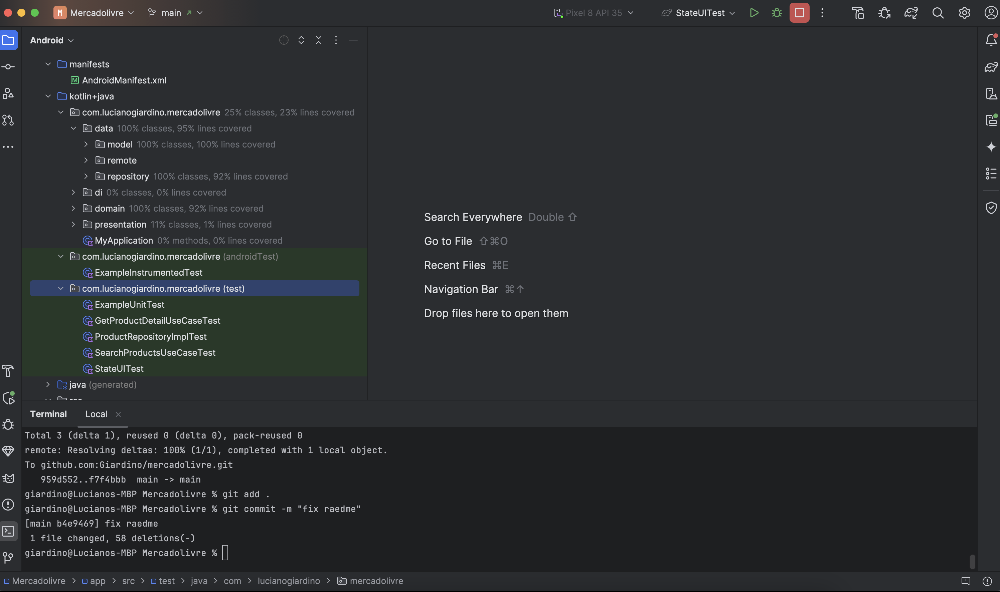
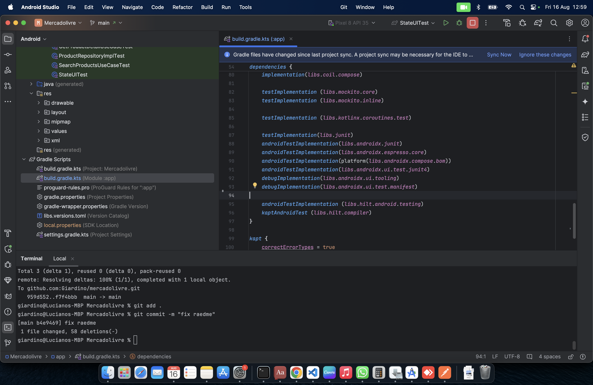
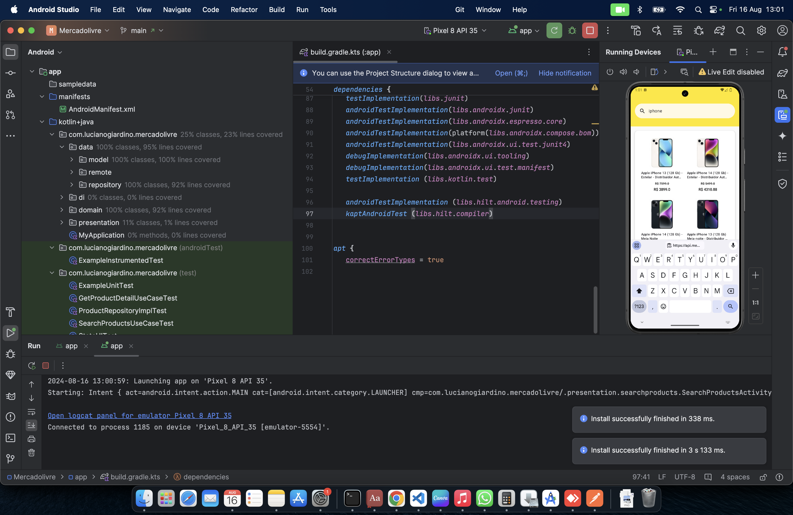
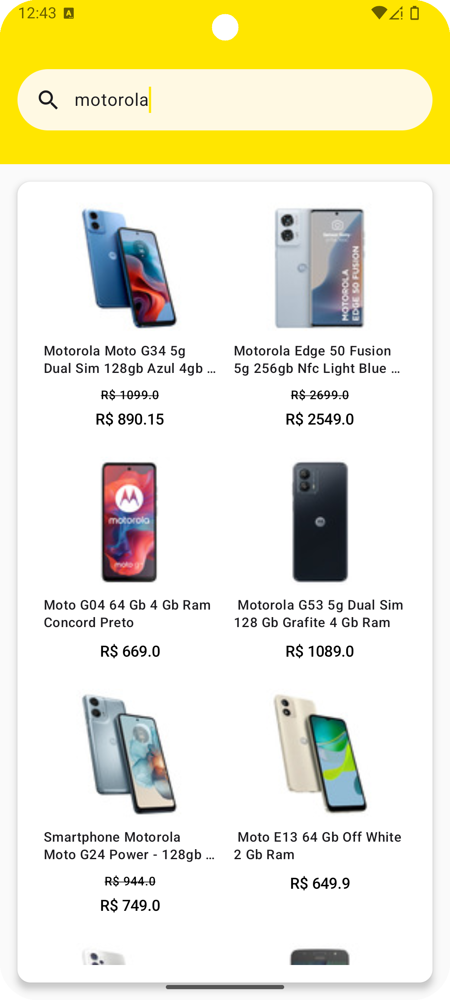
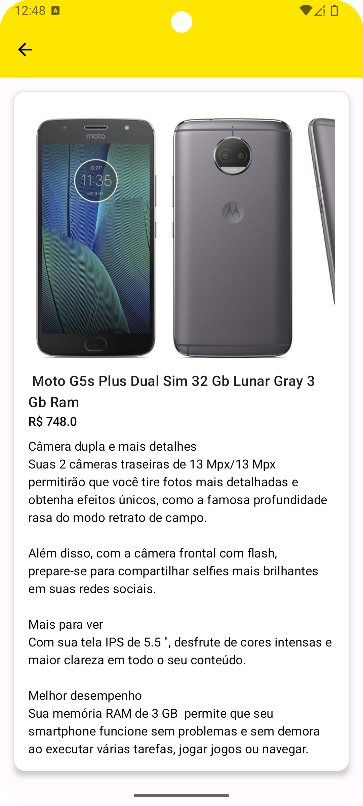

<h1>README</h1>

| Data | Autor | Comentários | Versão |
| --- | --- | --- | --- |
| 16/10/2024 | Luciano Giardino | Versao inicial | 0.0.1 |  

## Information ##

Projeto Mobile Mercadolivre   

## Objective ##

Teste de desenvolvimento de projeto Mobile para o Mercadolivre

Aplicativo Android para teste técnico que permite pesquisar e visualizar detalhes de produtos do MercadoLivre. O projeto foi desenvolvido utilizando as melhores práticas de desenvolvimento, como Clean Architecture e Jetpack Compose.

:rocket: Funcionalidades
Pesquisa de Produtos: Permite que os usuários pesquisem produtos por nome.
Detalhes do Produto: Exibe informações detalhadas sobre os produtos, incluindo descrição, preço e imagens.


## Dependencies ##
* Java Development Kit (JDK) 11
* Kotlin: Linguagem principal do projeto.
* Hilt: Injeção de dependências.
* Retrofit: Cliente HTTP para chamadas de API.
* Jetpack: Framework que ajuda desenvolvedores a seguir as práticas recomendadas
* Jetpack Compose: Framework para construção de UI nativo do Android.
* JUnit e Mockito: Testes unitários.

## Clone Project ##	

Clonar e baixar o projeto

```
$ git clone https://github.com/Giardino/mercadolivre.git
```

ou

```
$ git clone git@github.com:Giardino/mercadolivre.git
```

## Structure ##

Estrutura de pastas de projeto  


|---|---|
| Pastas/Arquivo | Informações |
|---|---|
| \data |  |
| \data\repository | Repository projeto |
| \data\remote | Interface projeto |
| \domain | |
| \domain\model | Models Projeto |
| \domain\usecase | Usecase Projeto |
| \presentation | |
| \presentation\viewmodel | Viewmodel Projeto |
| \presentation\state | State Projeto |
| \presentation\ui | UI Projeto |
| \di | |
|---|---|

## Information ##

Abra o projeto no Android Studio.  

[](image-003.png)

Sincronize o Gradle para baixar todas as dependências.  

[](image-004.png)

Conecte seu dispositivo ou emulador Android e execute o projeto.  

[](image-005.png)


Aplicação executando

[](image-001.png)

[](image-002.png)


## Deploy & Run  ##	

Para e testar o projeto execute o comando abaixo

```
./gradlew assembleDebug
```

## More Info ##

luciano.giardino@gmail.com

## Links ##

https://kotlinlang.org/
https://developer.android.com/kotlin?hl=pt-br